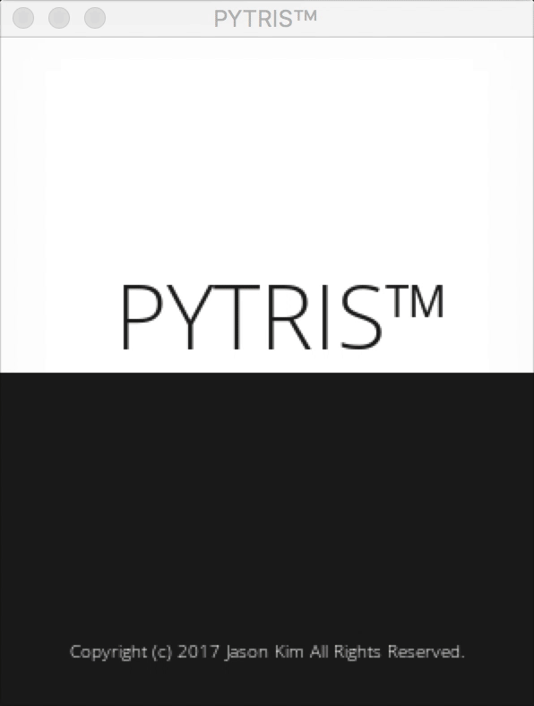
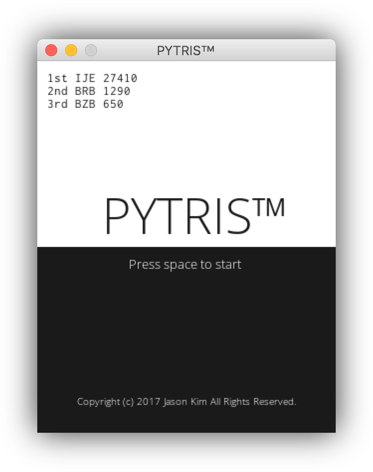
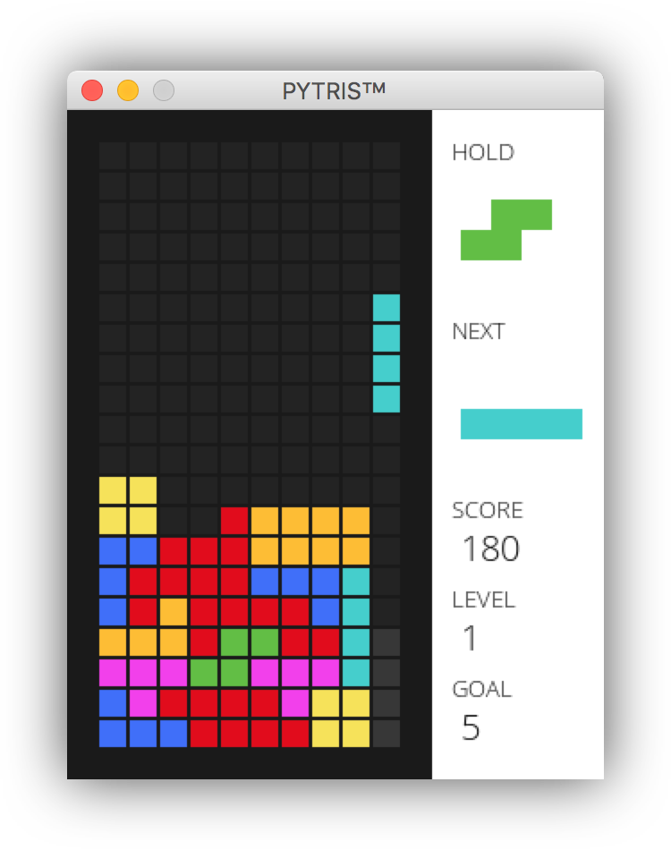
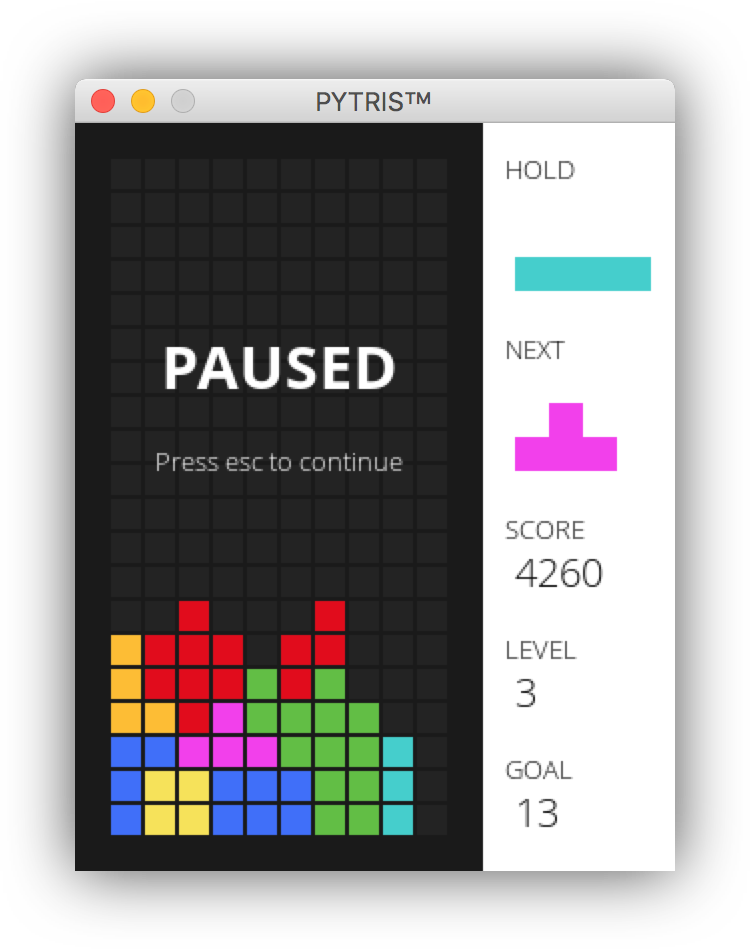
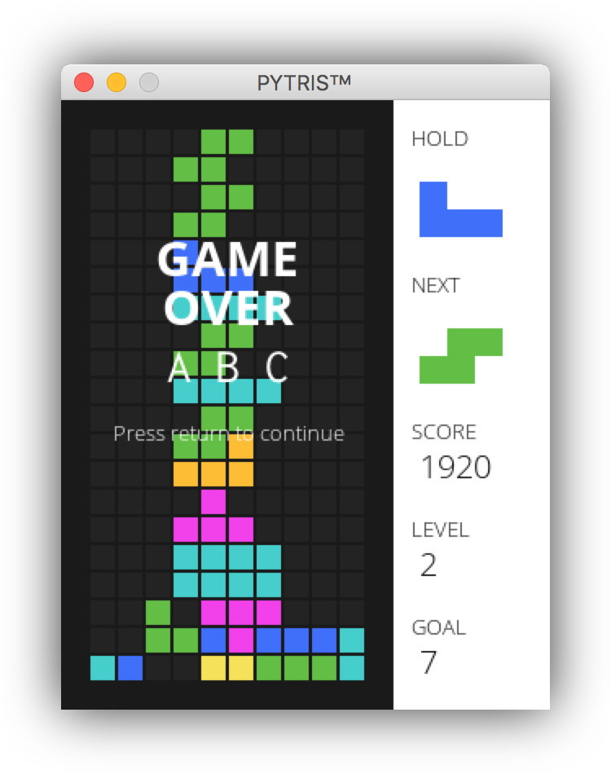

# PYTRIS™

tetris made with pygame

## How to play
| Command      | Key           |
|--------------|---------------|
| Move left    | Left          |
| Move right   | Right         |
| Rotate right | Up / X        |
| Rotate left  | Left ctrl / Z |
| Soft drop    | Down arrow    |
| Hard drop    | Space         |
| Hold block   | Left shift / C|
| Pause game   | Esc           |

More on [How to play](https://github.com/k0626089/PYTRIS/wiki/How-to-play)

## Score board
| Action       | Score       |
|--------------|-------------|
| Block drop   | 10 * level  |
| Single       | 50 * level  |
| Double       | 150 * level |
| Triple       | 350 * level |
| Tetris       | 1000 * level|

## Screenshots

More informations on [PYTRIS™ Wiki](https://github.com/k0626089/PYTRIS/wiki)
