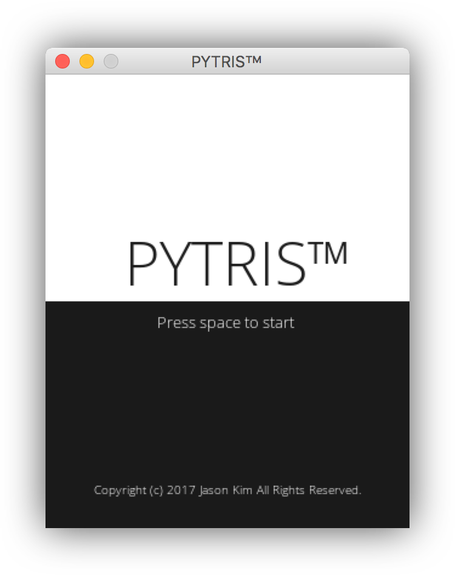
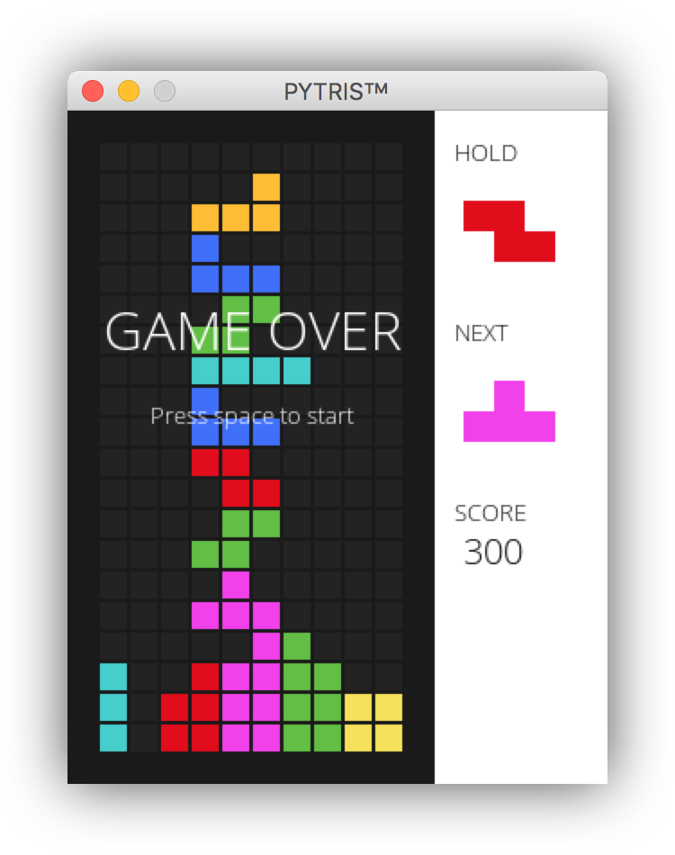

# PYTRIS™
tetris made with pygame

## How to play
| Command      | Key         |
|--------------|-------------|
| Move left    | Left arrow  |
| Move right   | Right arrow |
| Rotate right | Up arrow    |
| Soft drop    | Down arrow  |
| Hard drop    | Space       |
| Hold block   | Left shift  |

More on [How to play](https://github.com/k0626089/PYTRIS/wiki/How-to-play)

## Score board
| Action       | Score       |
|--------------|-------------|
| Block drop   | 10 * level  |
| Single       | 50 * level  |
| Double       | 150 * level |
| Triple       | 350 * level |
| Tetris       | 1000 * level|

## Things that work
- [Start screen with blinking text](https://github.com/k0626089/PYTRIS/wiki/Things-that-work#start-screen-with-blinking-text)
- [Randomly generated tetrimino blocks](https://github.com/k0626089/PYTRIS/wiki/Things-that-work#randomly-generated-tetrimino-blocks)
- [Displays](https://github.com/k0626089/PYTRIS/wiki/Things-that-work#displays)
- [Level system](https://github.com/k0626089/PYTRIS/wiki/Things-that-work#level-system)
- [Preventing invalid moves](https://github.com/k0626089/PYTRIS/wiki/Things-that-work#preventing-invalid-moves)
- [Remove maxed out rows](https://github.com/k0626089/PYTRIS/wiki/Things-that-work#remove-maxed-out-rows)
- [Sound effects](https://github.com/k0626089/PYTRIS/wiki/Resources#sound-source)
- [Game over when the board is full](https://github.com/k0626089/PYTRIS/wiki/Things-that-work#game-over-when-the-board-is-full)
- [Ghost](https://github.com/k0626089/PYTRIS/wiki/Things-that-work#Ghost)

## Things that don't work
Everything seem to work for now

## Future plans
- [T-spin](https://github.com/k0626089/PYTRIS/wiki/Future-plans#t-spin-support)
- [High score system](https://github.com/k0626089/PYTRIS/wiki/Future-plans#high-score-system)
- [Ghost](https://github.com/k0626089/PYTRIS/wiki/Future-plans#ghost)

## Screenshots

More informations on [PYTRIS™ Wiki](https://github.com/k0626089/PYTRIS/wiki)
