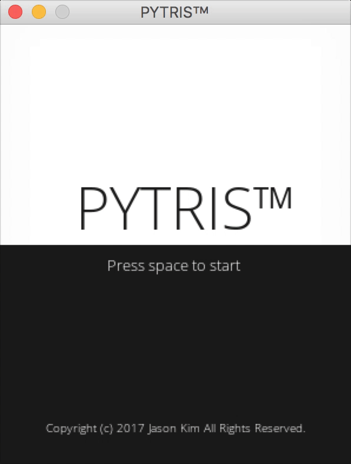

# PYTRIS™
tetris made with pygame

## Things that work
- Start screen with blinking text
- Randomly generated tetrimino blocks
- Next block indicator
- Hold block Function
- Score display
- Preventing invalid moves
- Remove maxed out rows
- Sound effect for button clicks
- Sound effect for Single, Double, Triple and TETRIS
- Game over when screen is full

## Things that don't work
- T-spin support
- Level system

## Screenshots

